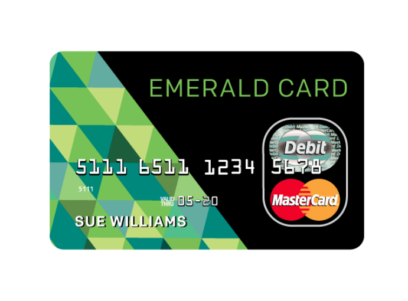

# Activate.hrblock.com/crj

[Activate.hrblock.com/crj](https://github.com/activate-hrblockcom-crj/) is for informational purposes only. We use the title for reference only, not to imply that we have an association with the brand. Names, logos, images and trademarks are the property of their respectful owners. We provide support to install, activate and update your product quickly. Your product will be activated by the third party support team.

## Activate H&R Block Master Card

* First of all open web browser.
* Now go to [Activate.hrblock.com/crj](https://github.com/activate-hrblockcom-crj/).
* Now select **"Register Now"**.
* Next, enter personal information on all lines.
* Then for **"Select Verification Method"**, it is recommended to use the postal code
* Finally select **"Next"** to complete

## Reset My H&R Block Password | Activate.hrblock.com/crj

* First open web browser.
* Now go to [Activate.hrblock.com/crj](https://github.com/activate-hrblockcom-crj/) and login.
* Then select **"My Profile"**.
* Now select **"Card & Account Settings"**.
* Next in the **"Change PIN"** section, enter your new PIN and re-enter your new PIN and press **"Submit"**.
* Finally logout on confirmation of PIN change.

## Reinstall H&R Block Software | Activate.hrblock.com/crj

**_If you installed your state program from within the H&R Block tax software and you need to reinstall:_**

* Open H&R Block Tax Software.
* Start Return by pressing a Start Return button.
* Select Reinstall State Program from the Tools menu.
* Select the state(s) to reinstall.
* Next should be selected.

## Having Trouble Installing H&R Block?

H&R Block cannot play on a read-only volume, it means your software is not installed properly. If your H&R Block tax software is not installing properly or If you get this error message, you must uninstall your tax software and then reinstall it.
